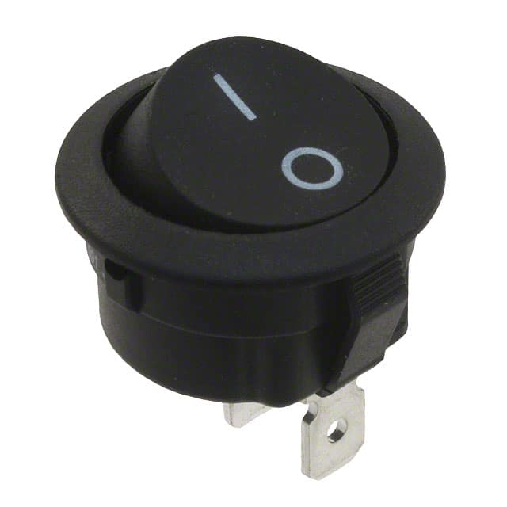

# Interstellar OTV Electonics Subsytem 

## Components

We use an **Arduino UNO** to control our OTV.  

Along with the Arduino, we use:  
**[1x Continuous servo motor](https://www.amazon.com/KOOKYE-360-Continuous-Rotation-Helicopter/dp/B019TOJPO4/ref=sr_1_7?crid=14QX980APVMMI&keywords=continuous%2Bservo%2Bmotor%2Barduino&qid=1647354622&sprefix=continuous%2Bservo%2Bm%2Caps%2C61&sr=8-7&th=1)** move our OTV's arm up and down.  
**[1x Ultrasonic sensor](https://www.amazon.com/HC-SR04-Ultrasonic-Distance-Measuring-MEGA2560/dp/B088BT8CDW/ref=asc_df_B088BT8CDW/?tag=hyprod-20&linkCode=df0&hvadid=533439785942&hvpos=&hvnetw=g&hvrand=4127217943768751677&hvpone=&hvptwo=&hvqmt=&hvdev=c&hvdvcmdl=&hvlocint=&hvlocphy=9007733&hvtargid=pla-1434560118174&psc=1)** to use in navigation.  
**[1x Reed switch](https://www.amazon.com/Magnetron-MagSwitch-Arduino-Digital-3-3V-5V/dp/B07MD9GFXN)** to detect magnetism.  
**[2x 12V DC motors](https://www.pololu.com/product/3491/specs)** for propulsion.  
**[1x L298N Dual HBridge Motorcontroller](https://www.amazon.com/Qunqi-2Packs-Controller-Stepper-Arduino/dp/B01M29YK5U)** to controller our 2 motors.  
For duty cycle detection, we will use **[brass wool](https://bluethundertechnologies.com/product/jbc-cl6210-brass-wool/)**.  

      

## Battery/Power Details and Calculations  

To power our OTV, we decided to use a **[12V rechargable battery](https://www.amazon.com/Tenergy-Capacity-Rechargeable-Replacement-Equipments/dp/B077Y9HNTF/ref=sr_1_7?crid=2S9DGJYMAKD4L&keywords=12v%2Blipo&qid=1645670114&sprefix=12v%2Blipo%2Caps%2C56&sr=8-7&th=1)**. This battery has a **[kill switch](https://www.digikey.com/en/products/detail/e-switch/RR511D1121/2116256?utm_adgroup=Essen%20Deinki&utm_source=google&utm_medium=cpc&utm_campaign=Shopping_DK%2BSupplier_Other&utm_term=&utm_content=Essen%20Deinki&gclid=CjwKCAiA1JGRBhBSEiwAxXblwUSK9cAvCC8N35mnBLSZNJDIzvzn7XprDbPOdZTN3Lrixi0Co2VLMxoCmTwQAvD_BwE)** attached. The battery has a 2000mAh capacity.    

 

### Calculations  

Our current draw calculations are as follows:  
Motors: Our calculated current draw for each motor is ~147.3 mA per motor, which is calculated based on our 18.7 Ncm operating torque. Using this torque and our 90 rpm operating speed gives us a wattage of 1.767 W, which diving by 12 and converting from A to mA gives us an operating current draw of ~147.3 mA per motor, or 294.6 mA for both motors.   
Ultrasonic: 15 mA while operating. (Source: [link](https://randomnerdtutorials.com/complete-guide-for-ultrasonic-sensor-hc-sr04/)).  
Reed Switch: The reed switch's current draw is negligible, and the reed switch is only operating for a small part of our mission, so we will not include this in our calculating.   
Servo motor: The arm servo has an operating current draw of 100 mA, though it could fluctuate higher. (Source: [Manufacturers' Website](https://kookye.com/2016/01/01/kookye-servo-motor-metal-gear-360-degree-rotation/)).  
Motorcontroller: The L298N Dual HBridge uses 36 mA for functions not related to powering the motors themselves, according to [Banana Robotics](https://www.bananarobotics.com/shop/L298N-Dual-H-Bridge-Motor-Driver).  
WiFi Module: According to [source](https://www.instructables.com/ESP8266-Pro-Tips/#:~:text=An%20esp8266%20chip%20can%20draw,not%20be%20less%20than%20170mA.), the ESP8266 can draw up to 170 mA.  

The total current draw based on all components is ~615.6 mA.
Based on our battery's 2000mAh capacity, our OTV should be able to run for around 3.25 hours.

## Ardunio Pinouts

  

2: Propulsion: DirB 1  
3: Ultrasonic TX  
4: Ultrasonic RX  
5: Arm Servo Signal  
6: Propulsion: DirA 2  
7: Propulsion: DirA 1  
8: WiFi RX  
9: WiFi TX  
10: Propulsion: ENA   
11: Propulsion: ENB  
12: DutyCycle  
13: Propulsion: DirB 2  
A0: Reed Switch (read as digital input in code)  

**HBRIDGE**: IN1 = DirA 1; IN2 = DirA 2; IN3 = DirB 1; IN4 = DirB 2  
OUT 1-4 to motors  

## Circuit Schematic

Battery is connected to breadboard, creating a 12V rail. Ardunio Vin will connect to this rail. Other breadboard rail will be 5V from Ardunio 5V.  

**The sensors/actuators connect to the rails as follows:**  
Ultrasonic Sensor to 5V rail  
Arm Servo to 5V rail  
WiFi module to 5V rail  
Reed Switch Module to 5V rail  
Dual HBridge Motorcontroller to 12V rail  
All of these components will also be connected to (any) ground rail.
